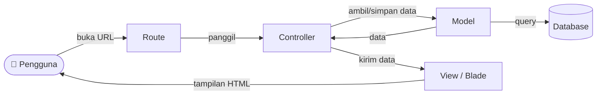

# 📘 Tutorial Lengkap Laravel untuk Pemula

> Panduan **step-by-step** dari nol sampai bisa membuat aplikasi CRUD dengan database.
> Ditulis khusus untuk **pemula** yang belum pernah memakai Laravel.

**Mata Kuliah:** Pemrograman Berbasis Kerangka Kerja (PBKK)
**Universitas:** Universitas Semarang
**Versi Laravel:** 10.x &nbsp;•&nbsp; **PHP:** 8.1 – 8.4

---

## 🧭 Cara Membaca Tutorial Ini

Tutorial ini dibuat **berurutan**. Jangan loncat-loncat kalau kamu benar-benar pemula.

1. Selesaikan dulu bagian **Persiapan** (install tools) di bawah ini.
2. Kerjakan praktikum **satu per satu**, mulai dari Praktikum 01.
3. Setiap praktikum dibangun di atas praktikum sebelumnya (incremental).
4. Kalau bingung, lihat bagian **Troubleshooting** dan **Glosarium** di bagian akhir.

> 💡 **Tips:** Ketik ulang kodenya, jangan hanya copy-paste. Dengan mengetik, otakmu lebih cepat paham.

### Daftar Isi

| Bagian                                                         | Isi                                                   |
| -------------------------------------------------------------- | ----------------------------------------------------- |
| [Bagian 0](#bagian-0--persiapan-alat-tempur)                   | Persiapan: install PHP, Composer, MySQL, Node, Editor |
| [Bagian 1](#bagian-1--mengenal-laravel)                        | Mengenal Laravel & struktur folder                    |
| [Bagian 2](#praktikum-01--install-laravel)                     | Praktikum 01: Install Laravel                         |
| [Bagian 3](#praktikum-02--routing--controller)                 | Praktikum 02: Routing & Controller                    |
| [Bagian 4](#praktikum-03--blade-template)                      | Praktikum 03: Blade Template                          |
| [Bagian 5](#praktikum-04--master-template-layout)              | Praktikum 04: Master Template                         |
| [Bagian 6](#praktikum-05--migration-model--seeder)             | Praktikum 05: Migration, Model, Seeder                |
| [Bagian 7](#praktikum-06--menampilkan-data-dari-database)      | Praktikum 06: Menampilkan Data                        |
| [Bagian 8](#praktikum-07--menambah-data-create)                | Praktikum 07: Tambah Data (Create)                    |
| [Bagian 9](#praktikum-08--mengedit-data-update)                | Praktikum 08: Edit Data (Update)                      |
| [Bagian 10](#praktikum-09--menghapus-data-delete)              | Praktikum 09: Hapus Data (Delete)                     |
| [Bagian 11](#praktikum-10--crud-program-studi-latihan-mandiri) | Praktikum 10: CRUD Program Studi                      |
| [Bagian 12](#-projek-akhir)                                    | Projek Akhir                                          |
| [Bagian 13](#-troubleshooting-error-yang-sering-muncul)        | Troubleshooting                                       |
| [Bagian 14](#-glosarium-istilah-penting)                       | Glosarium                                             |

---

## Bagian 0 — Persiapan (Alat Tempur)

Sebelum menyentuh Laravel, kita perlu menyiapkan beberapa software. Lakukan ini **hanya sekali** di komputermu.

### 0.1 Yang Harus Di-install

| Software          | Fungsi                                         | Versi Minimal |
| ----------------- | ---------------------------------------------- | ------------- |
| **PHP**           | Bahasa pemrograman yang dipakai Laravel        | 8.1           |
| **Composer**      | Manajer paket PHP (mengunduh library)          | Terbaru       |
| **MySQL**         | Database tempat menyimpan data                 | 8.0           |
| **Node.js & NPM** | Untuk membangun aset CSS/JS (opsional di awal) | 18+           |
| **Code Editor**   | Tempat menulis kode (disarankan VS Code)       | -             |

> 🪟 **Cara paling mudah di Windows:** install **Laragon** atau **XAMPP**. Keduanya sudah membawa PHP + MySQL sekaligus. Laragon lebih ringan dan modern, sangat direkomendasikan untuk pemula.

### 0.2 Install via Laragon (Rekomendasi untuk Windows)

1. Unduh Laragon dari https://laragon.org/download/
2. Install seperti aplikasi biasa (klik Next sampai selesai).
3. Buka Laragon, klik tombol **Start All**. MySQL dan Apache akan menyala.
4. Laragon sudah otomatis menyertakan PHP dan Composer.

### 0.3 Install Manual (Alternatif)

- **PHP & Composer:** unduh PHP dari https://windows.php.net/download lalu Composer dari https://getcomposer.org/download
- **MySQL:** unduh dari https://dev.mysql.com/downloads/installer/

### 0.4 Cek Apakah Semua Sudah Terpasang

Buka **Terminal** (di VS Code tekan `Ctrl + \``) lalu ketik perintah berikut satu per satu:

```bash
php --version
```

Harus muncul versi PHP, misal `PHP 8.2.x`.

```bash
composer --version
```

Harus muncul versi Composer.

```bash
mysql --version
```

Harus muncul versi MySQL.

```bash
node --version
```

Harus muncul versi Node, misal `v20.x`.

> ❗ Kalau ada perintah yang error `command not found`, berarti software tersebut belum terpasang atau belum masuk ke PATH. Pakai Laragon untuk menghindari masalah ini.

### 0.5 Install Extension VS Code (Opsional tapi Sangat Membantu)

Buka VS Code → tab Extensions (`Ctrl + Shift + X`) → cari dan install:

- **PHP Intelephense** — autocomplete PHP
- **Laravel Blade Snippets** — autocomplete file `.blade.php`
- **Laravel Artisan** — menjalankan perintah artisan dari VS Code

---

## Bagian 1 — Mengenal Laravel

### 1.1 Apa Itu Laravel?

Laravel adalah **framework** PHP. Framework artinya "kerangka kerja": kumpulan kode siap pakai yang membantu kita membangun aplikasi web lebih cepat, rapi, dan aman tanpa menulis semuanya dari nol.

Analogi sederhana: kalau membangun rumah, Laravel sudah menyiapkan fondasi, tembok, dan listrik. Kita tinggal mengatur ruangan sesuai kebutuhan.

### 1.2 Pola MVC (Model–View–Controller)

Laravel memakai pola **MVC**. Ini konsep paling penting yang harus kamu pahami:



| Komponen         | Tugas                                   | Lokasi File             |
| ---------------- | --------------------------------------- | ----------------------- |
| **Route**        | Menentukan URL apa memanggil fungsi apa | `routes/web.php`        |
| **Controller**   | Otak aplikasi, mengatur logika          | `app/Http/Controllers/` |
| **Model**        | Penghubung ke tabel database            | `app/Models/`           |
| **View (Blade)** | Tampilan yang dilihat pengguna          | `resources/views/`      |

### 1.3 Struktur Folder Laravel (Yang Perlu Kamu Tahu)

Saat membuka project Laravel, kamu akan melihat banyak folder. Untuk pemula, **cukup fokus pada 4 folder ini**:

```
praktikum_laravel/
├── app/
│   ├── Http/Controllers/   ← 🧠 Controller (logika aplikasi) ada di sini
│   └── Models/             ← 🔗 Model (penghubung database) ada di sini
├── database/
│   ├── migrations/         ← 🏗️ Struktur tabel database
│   └── seeders/            ← 🌱 Data contoh untuk mengisi database
├── resources/
│   └── views/              ← 🎨 File tampilan (.blade.php) ada di sini
├── routes/
│   └── web.php             ← 🗺️ Daftar semua URL aplikasi
├── public/                 ← 📂 File yang bisa diakses publik (gambar, CSS, JS)
├── .env                    ← ⚙️ Konfigurasi (database, dll) — JANGAN di-share!
└── composer.json           ← 📦 Daftar library yang dipakai
```

Folder lain (`bootstrap/`, `config/`, `storage/`, `vendor/`) belum perlu kamu utak-atik untuk sekarang.

---

## Praktikum 01 — Install Laravel

> 🎯 **Tujuan:** Berhasil membuat project Laravel baru dan menjalankannya di browser.
> 📁 **Folder:** `praktikum_01_install/praktikum_laravel/`

### Langkah 1.1 — Buat Project Laravel Baru

Buka terminal, masuk ke folder tempat kamu ingin menyimpan project, lalu jalankan:

```bash
composer create-project laravel/laravel:^10.0 praktikum_laravel
```

Perintah ini mengunduh Laravel versi 10 dan menaruhnya di folder bernama `praktikum_laravel`. Proses ini butuh koneksi internet dan beberapa menit (Composer mengunduh banyak file).

> 💡 **Apa yang terjadi?** Composer membaca daftar kebutuhan Laravel, lalu mengunduh semua library ke folder `vendor/`. Folder `vendor/` ini besar dan **tidak** ikut di-upload ke GitHub (sudah diatur di `.gitignore`).

### Langkah 1.2 — Masuk ke Folder Project

```bash
cd praktikum_laravel
```

### Langkah 1.3 — Siapkan File Konfigurasi `.env`

Laravel butuh file `.env` untuk menyimpan konfigurasi. Saat install baru, file ini biasanya sudah otomatis dibuat. Kalau belum ada, salin dari contoh:

```bash
# Windows (PowerShell)
Copy-Item .env.example .env

# Mac/Linux
cp .env.example .env
```

### Langkah 1.4 — Generate Application Key

```bash
php artisan key:generate
```

Perintah ini mengisi nilai `APP_KEY` di file `.env`. Key ini dipakai Laravel untuk mengenkripsi data (misalnya session). **Wajib** dilakukan, kalau tidak akan muncul error.

### Langkah 1.5 — Jalankan Server

```bash
php artisan serve
```

Akan muncul tulisan seperti:

```
INFO  Server running on [http://127.0.0.1:8000].
```

### Langkah 1.6 — Buka di Browser

Buka browser, ketik alamat:

```
http://localhost:8000
```

Kalau muncul halaman selamat datang Laravel (logo Laravel berwarna merah), **selamat! Instalasi berhasil.** 🎉

> ⏹️ Untuk menghentikan server, kembali ke terminal dan tekan `Ctrl + C`.

### ✅ Checklist Praktikum 01

- [ ] Project Laravel berhasil dibuat dengan `composer create-project`
- [ ] File `.env` ada dan `APP_KEY` sudah terisi
- [ ] Server berjalan dengan `php artisan serve`
- [ ] Halaman welcome Laravel tampil di browser

---

## Praktikum 02 — Routing & Controller

> 🎯 **Tujuan:** Memahami cara kerja Route dan Controller dengan menampilkan data mahasiswa (masih data dummy/contoh, belum dari database).
> 📁 **Folder:** `praktikum_02_routing_controller/praktikum_laravel/`

> ♻️ **Cara mulai praktikum baru:** Salin project dari praktikum sebelumnya, lalu tambahkan fitur baru. Lihat [cara menyalin project](#cara-menyalin-project-antar-praktikum) di bagian bawah.

### Konsep: Route → Controller → View

- **Route** = alamat URL. Misal `/mahasiswa`.
- **Controller** = fungsi yang dijalankan saat URL itu dibuka.
- **View** = tampilan HTML yang dikirim balik ke pengguna.

### Langkah 2.1 — Buat Controller

Jalankan perintah artisan untuk membuat controller otomatis:

```bash
php artisan make:controller MahasiswaController
```

File baru akan muncul di `app/Http/Controllers/MahasiswaController.php`.

### Langkah 2.2 — Isi Controller dengan Data Dummy

Buka `app/Http/Controllers/MahasiswaController.php`, isi dengan kode berikut:

```php
<?php

namespace App\Http\Controllers;

use Illuminate\Http\Request;

class MahasiswaController extends Controller
{
    public function index()
    {
        // Data mahasiswa dummy (contoh), belum dari database
        $mahasiswa = [
            ['nim' => '20240001', 'nama' => 'Fajar Santoso', 'prodi' => 'Manajemen'],
            ['nim' => '20240002', 'nama' => 'Lani Utami',    'prodi' => 'Manajemen'],
            ['nim' => '20240003', 'nama' => 'Agus Wijaya',   'prodi' => 'Ilmu Komunikasi'],
        ];

        // Kirim data ke view 'mahasiswa.index'
        return view('mahasiswa.index', compact('mahasiswa'));
    }

    public function show(string $id)
    {
        return "Menampilkan mahasiswa dengan ID: " . $id;
    }
}
```

> 📝 **Penjelasan:**
>
> - `compact('mahasiswa')` mengirim variabel `$mahasiswa` ke view.
> - `view('mahasiswa.index', ...)` artinya menampilkan file `resources/views/mahasiswa/index.blade.php`.

### Langkah 2.3 — Daftarkan Route

Buka `routes/web.php`, tambahkan di bagian atas dan bawah:

```php
<?php

use Illuminate\Support\Facades\Route;
use App\Http\Controllers\MahasiswaController;

Route::get('/', function () {
    return view('welcome');
});

// Route untuk menampilkan daftar mahasiswa
Route::get('/mahasiswa', [MahasiswaController::class, 'index']);

// Route untuk menampilkan detail satu mahasiswa berdasarkan id
Route::get('/mahasiswa/{id}', [MahasiswaController::class, 'show']);
```

> 📝 **Penjelasan:**
>
> - `Route::get('/mahasiswa', ...)` artinya: saat ada yang membuka `/mahasiswa` dengan method GET, jalankan method `index` di `MahasiswaController`.
> - `{id}` adalah parameter dinamis. `/mahasiswa/5` akan mengirim `5` ke method `show`.

### Langkah 2.4 — Buat View

Buat folder `resources/views/mahasiswa/`, lalu buat file `index.blade.php` di dalamnya:

```blade
<!DOCTYPE html>
<html lang="id">
<head>
    <meta charset="UTF-8">
    <title>Daftar Mahasiswa</title>
</head>
<body>
    <h1>Daftar Mahasiswa</h1>
    <table border="1" cellpadding="8">
        <tr>
            <th>NIM</th>
            <th>Nama</th>
            <th>Program Studi</th>
        </tr>
        @foreach ($mahasiswa as $mhs)
        <tr>
            <td>{{ $mhs['nim'] }}</td>
            <td>{{ $mhs['nama'] }}</td>
            <td>{{ $mhs['prodi'] }}</td>
        </tr>
        @endforeach
    </table>
</body>
</html>
```

### Langkah 2.5 — Jalankan & Cek

```bash
php artisan serve
```

Buka `http://localhost:8000/mahasiswa`. Tabel berisi 3 mahasiswa harus tampil. Coba juga buka `http://localhost:8000/mahasiswa/7` untuk melihat hasil method `show`.

### ✅ Checklist Praktikum 02

- [ ] `MahasiswaController` berhasil dibuat
- [ ] Route `/mahasiswa` dan `/mahasiswa/{id}` terdaftar
- [ ] View `mahasiswa/index.blade.php` menampilkan tabel
- [ ] Data dummy tampil di browser

---

## Praktikum 03 — Blade Template

> 🎯 **Tujuan:** Mendalami **Blade**, mesin template Laravel, untuk menampilkan data dengan lebih rapi.
> 📁 **Folder:** `praktikum_03_blade_template/praktikum_laravel/`

### Konsep: Apa Itu Blade?

Blade adalah cara menulis HTML yang bisa "dicampur" dengan kode PHP secara rapi. File Blade selalu berakhiran `.blade.php`.

**Sintaks Blade yang paling sering dipakai:**

| Sintaks                    | Fungsi                                     | Contoh         |
| -------------------------- | ------------------------------------------ | -------------- |
| `{{ $variabel }}`          | Menampilkan nilai variabel (aman dari XSS) | `{{ $nama }}`  |
| `@foreach ... @endforeach` | Perulangan                                 | looping data   |
| `@if ... @endif`           | Percabangan                                | kondisi        |
| `@extends('...')`          | Mewarisi layout induk                      | template induk |
| `@section / @yield`        | Mengisi/menyediakan bagian layout          | konten dinamis |
| `{{-- komentar --}}`       | Komentar (tidak tampil di HTML)            | catatan        |

> 🔒 **Kenapa `{{ }}`?** Blade otomatis mengamankan output dari serangan XSS. Lebih aman daripada `echo` biasa.

### Langkah 3.1 — Tambah Data Dummy (Minimal 5)

Update method `index()` di `MahasiswaController` agar punya 5 data lengkap:

```php
public function index()
{
    $mahasiswa = [
        ['nim' => '20240001', 'nama' => 'Fajar Santoso',  'tempat_lahir' => 'Yogyakarta', 'tgl_lahir' => '2003-08-02', 'jenis_kelamin' => 'Perempuan',  'prodi' => 'Manajemen'],
        ['nim' => '20240002', 'nama' => 'Lani Utami',     'tempat_lahir' => 'Bandung',    'tgl_lahir' => '2003-03-11', 'jenis_kelamin' => 'Laki-laki',  'prodi' => 'Manajemen'],
        ['nim' => '20240003', 'nama' => 'Agus Wijaya',    'tempat_lahir' => 'Bandung',    'tgl_lahir' => '2001-01-28', 'jenis_kelamin' => 'Laki-laki',  'prodi' => 'Ilmu Komunikasi'],
        ['nim' => '20240004', 'nama' => 'Rian Utami',     'tempat_lahir' => 'Jakarta',    'tgl_lahir' => '2000-04-10', 'jenis_kelamin' => 'Laki-laki',  'prodi' => 'Psikologi'],
        ['nim' => '20240005', 'nama' => 'Budi Wulandari', 'tempat_lahir' => 'Medan',      'tgl_lahir' => '2002-11-21', 'jenis_kelamin' => 'Laki-laki',  'prodi' => 'Akuntansi'],
    ];

    return view('mahasiswa.index', compact('mahasiswa'));
}
```

### Langkah 3.2 — Tampilkan dengan Tabel & `@foreach`

Update `resources/views/mahasiswa/index.blade.php`:

```blade
<!DOCTYPE html>
<html lang="id">
<head>
    <meta charset="UTF-8">
    <title>Daftar Mahasiswa</title>
</head>
<body>
    <h1>Daftar Mahasiswa</h1>
    <table border="1" cellpadding="8" cellspacing="0">
        <thead>
            <tr>
                <th>NIM</th>
                <th>Nama</th>
                <th>Tempat, Tgl Lahir</th>
                <th>Jenis Kelamin</th>
                <th>Program Studi</th>
            </tr>
        </thead>
        <tbody>
            @foreach ($mahasiswa as $mhs)
            <tr>
                <td>{{ $mhs['nim'] }}</td>
                <td>{{ $mhs['nama'] }}</td>
                <td>{{ $mhs['tempat_lahir'] }}, {{ $mhs['tgl_lahir'] }}</td>
                <td>{{ $mhs['jenis_kelamin'] }}</td>
                <td>{{ $mhs['prodi'] }}</td>
            </tr>
            @endforeach
        </tbody>
    </table>
</body>
</html>
```

### Langkah 3.3 — Jalankan & Cek

```bash
php artisan serve
```

Buka `http://localhost:8000/mahasiswa`. Tabel dengan 5 baris data harus tampil rapi.

### ✅ Checklist Praktikum 03

- [ ] Controller punya minimal 5 data mahasiswa
- [ ] View memakai `@foreach` untuk looping
- [ ] Tabel tampil dengan 5 kolom
- [ ] Memahami beda `{{ }}` dengan `@foreach`

---

## Praktikum 04 — Master Template (Layout)

> 🎯 **Tujuan:** Membuat **layout induk** agar tidak perlu menulis ulang header/sidebar/footer di setiap halaman. Memakai template admin Bootstrap (Quixlab).
> 📁 **Folder:** `praktikum_04_master_template/praktikum_laravel/`

### Konsep: Kenapa Butuh Master Template?

Bayangkan aplikasi punya 10 halaman. Kalau header dan sidebar ditulis ulang di tiap halaman, saat mau ganti logo kamu harus edit 10 file. Dengan **master template**, kamu cukup edit **1 file induk**.

```mermaid
flowchart TB
    Layout["layout.blade.php (INDUK)<br/>header + sidebar + footer"]
    Layout -->|@yield content| Page1["mahasiswa/index.blade.php"]
    Layout -->|@yield content| Page2["dashboard.blade.php"]
    Layout -->|@yield content| Page3["halaman lain..."]
```

### Langkah 4.1 — Siapkan Aset Template

1. Unduh template admin gratis **Quixlab** (Bootstrap) atau template sejenis.
2. Salin folder aset (`css`, `js`, `images`, `vendor`) ke dalam `public/assets/`.

Sehingga strukturnya menjadi:

```
public/
└── assets/
    ├── css/
    ├── js/
    ├── images/
    └── vendor/
```

> 💡 **Penting:** Semua file statis (CSS/JS/gambar) harus ada di folder `public/`. Untuk memanggilnya di Blade, pakai helper `asset()`, contoh: `{{ asset('assets/css/style.css') }}`.

### Langkah 4.2 — Buat File Layout Induk

Buat folder `resources/views/layout/`, lalu buat file `layout.blade.php`:

```blade
<!DOCTYPE html>
<html lang="id">
<head>
    <meta charset="utf-8">
    <meta name="viewport" content="width=device-width, initial-scale=1">
    <title>{{ $master['title'] ?? 'Aplikasi Akademik' }}</title>

    {{-- CSS dari folder public/assets --}}
    <link href="{{ asset('assets/css/style.css') }}" rel="stylesheet">
</head>
<body>
    {{-- HEADER --}}
    <header>
        <h2>Aplikasi Akademik</h2>
    </header>

    {{-- SIDEBAR / NAVIGASI --}}
    <nav>
        <ul>
            <li><a href="/">Dashboard</a></li>
            <li><a href="{{ url('/mahasiswa') }}">Mahasiswa</a></li>
        </ul>
    </nav>

    {{-- KONTEN UTAMA (diisi oleh halaman anak) --}}
    <main>
        @yield('content')
    </main>

    {{-- FOOTER --}}
    <footer>
        <p>&copy; {{ date('Y') }} Universitas Semarang</p>
    </footer>

    {{-- JS dari folder public/assets --}}
    <script src="{{ asset('assets/js/scripts.js') }}"></script>
</body>
</html>
```

> 📝 **`@yield('content')`** adalah "lubang" tempat konten halaman anak akan dimasukkan.

### Langkah 4.3 — Sambungkan Halaman Anak ke Layout

Update `resources/views/mahasiswa/index.blade.php` agar memakai layout:

```blade
@extends('layout.layout')

@section('content')
    <h1>Daftar Mahasiswa</h1>
    <table border="1" cellpadding="8" cellspacing="0">
        <thead>
            <tr>
                <th>NIM</th><th>Nama</th><th>Program Studi</th>
            </tr>
        </thead>
        <tbody>
            @foreach ($mahasiswa as $mhs)
            <tr>
                <td>{{ $mhs['nim'] }}</td>
                <td>{{ $mhs['nama'] }}</td>
                <td>{{ $mhs['prodi'] }}</td>
            </tr>
            @endforeach
        </tbody>
    </table>
@endsection
```

> 📝 **Penjelasan:**
>
> - `@extends('layout.layout')` = halaman ini mewarisi `layout/layout.blade.php`.
> - Semua yang ada di antara `@section('content')` dan `@endsection` akan dimasukkan ke `@yield('content')` pada layout induk.

### Langkah 4.4 — Buat Halaman Dashboard (Opsional)

Buat `resources/views/dashboard.blade.php`:

```blade
@extends('layout.layout')

@section('content')
    <h1>Selamat Datang di Dashboard</h1>
    <p>Ini halaman utama aplikasi akademik.</p>
@endsection
```

Lalu di `routes/web.php`:

```php
Route::get('/', function () {
    return view('dashboard');
});
```

### ✅ Checklist Praktikum 04

- [ ] Aset template ada di `public/assets/`
- [ ] File `layout/layout.blade.php` dibuat
- [ ] Halaman mahasiswa memakai `@extends` dan `@section`
- [ ] Header/sidebar/footer tampil di semua halaman
- [ ] Memahami `@yield` vs `@section`

---

## Praktikum 05 — Migration, Model & Seeder

> 🎯 **Tujuan:** Mulai memakai **database sungguhan**. Membuat tabel lewat migration, membuat Model, dan mengisi data contoh lewat seeder.
> 📁 **Folder:** `praktikum_05_migration_model_seeder/praktikum_laravel/`

Ini titik balik penting: dari sini data **disimpan permanen di database**, bukan lagi dummy di controller.

### Konsep Penting

| Istilah       | Penjelasan Sederhana                                                                 |
| ------------- | ------------------------------------------------------------------------------------ |
| **Migration** | Resep untuk membuat/mengubah struktur tabel database (pakai kode, bukan klik manual) |
| **Model**     | Class PHP yang mewakili satu tabel. Lewat model kita ambil/simpan data               |
| **Seeder**    | Pengisi data contoh otomatis ke database                                             |
| **Eloquent**  | Sistem ORM Laravel yang membuat akses database semudah memanggil method              |
| **Relasi**    | Hubungan antar tabel (misal: 1 prodi punya banyak mahasiswa)                         |

### Langkah 5.1 — Buat Database di MySQL

Buka phpMyAdmin (atau klik Database di Laragon) lalu buat database baru bernama `akademik`. Atau via terminal:

```bash
mysql -u root -p
```

```sql
CREATE DATABASE akademik;
EXIT;
```

### Langkah 5.2 — Sambungkan Laravel ke Database

Buka file `.env`, cari bagian `DB_` dan sesuaikan:

```env
DB_CONNECTION=mysql
DB_HOST=127.0.0.1
DB_PORT=3306
DB_DATABASE=akademik
DB_USERNAME=root
DB_PASSWORD=
```

> ⚠️ `DB_PASSWORD` dikosongkan kalau MySQL-mu tidak pakai password (default Laragon/XAMPP). Kalau pakai password, isi di sini.

### Langkah 5.3 — Buat Migration untuk Tabel `program_studis`

```bash
php artisan make:migration create_program_studis_table
```

File baru muncul di `database/migrations/`. Buka dan isi method `up()`:

```php
public function up(): void
{
    Schema::create('program_studis', function (Blueprint $table) {
        $table->id();                          // kolom id (primary key, auto increment)
        $table->string('kode_prodi', 10)->unique(); // kode unik, contoh: SI, TI
        $table->string('nama_prodi', 100);     // nama lengkap prodi
        $table->timestamps();                  // kolom created_at & updated_at otomatis
    });
}
```

### Langkah 5.4 — Buat Migration untuk Tabel `mahasiswas`

```bash
php artisan make:migration create_mahasiswas_table
```

Isi method `up()`:

```php
public function up(): void
{
    Schema::create('mahasiswas', function (Blueprint $table) {
        $table->id();
        $table->string('nim', 20)->unique();
        $table->string('nama', 100);
        $table->string('tempat_lahir', 50);
        $table->date('tanggal_lahir');
        $table->enum('jenis_kelamin', ['L', 'P']); // hanya boleh L atau P
        // Foreign key: menghubungkan ke tabel program_studis
        $table->foreignId('prodi_id')->constrained('program_studis')->onDelete('cascade');
        $table->timestamps();
    });
}
```

> 📝 **`foreignId('prodi_id')->constrained(...)`** membuat kolom penghubung. `onDelete('cascade')` artinya: kalau prodi dihapus, mahasiswanya ikut terhapus.

> ⚠️ **Urutan penting!** Tabel `program_studis` harus dibuat **lebih dulu** sebelum `mahasiswas`, karena `mahasiswas` mereferensikan `program_studis`. Pastikan nama file migration `program_studis` punya timestamp lebih awal.

### Langkah 5.5 — Jalankan Migration

```bash
php artisan migrate
```

Laravel akan membuat semua tabel di database `akademik`. Cek di phpMyAdmin, tabel `program_studis` dan `mahasiswas` harus muncul.

> 💡 Kalau ingin mengulang dari awal (hapus semua tabel lalu buat ulang): `php artisan migrate:fresh`

### Langkah 5.6 — Buat Model

```bash
php artisan make:model ProgramStudi
php artisan make:model Mahasiswa
```

File muncul di `app/Models/`. Isi `app/Models/ProgramStudi.php`:

```php
<?php

namespace App\Models;

use Illuminate\Database\Eloquent\Factories\HasFactory;
use Illuminate\Database\Eloquent\Model;

class ProgramStudi extends Model
{
    use HasFactory;

    protected $table = 'program_studis';

    protected $fillable = ['kode_prodi', 'nama_prodi'];

    // Relasi: 1 program studi memiliki BANYAK mahasiswa
    public function mahasiswas()
    {
        return $this->hasMany(Mahasiswa::class, 'prodi_id');
    }
}
```

Isi `app/Models/Mahasiswa.php`:

```php
<?php

namespace App\Models;

use Illuminate\Database\Eloquent\Factories\HasFactory;
use Illuminate\Database\Eloquent\Model;

class Mahasiswa extends Model
{
    use HasFactory;

    protected $table = 'mahasiswas';

    protected $fillable = [
        'nim', 'nama', 'tempat_lahir',
        'tanggal_lahir', 'jenis_kelamin', 'prodi_id',
    ];

    protected $casts = [
        'tanggal_lahir' => 'date',
    ];

    // Relasi: 1 mahasiswa DIMILIKI oleh 1 program studi
    public function prodi()
    {
        return $this->belongsTo(ProgramStudi::class, 'prodi_id', 'id');
    }
}
```

> 📝 **`$fillable`** adalah daftar kolom yang boleh diisi massal (mass assignment). Wajib diisi, kalau tidak Laravel menolak penyimpanan demi keamanan.
> 📝 **`hasMany` vs `belongsTo`:** sisi "punya banyak" pakai `hasMany`, sisi "dimiliki" pakai `belongsTo`. Inilah relasi **One-to-Many**.

### Langkah 5.7 — Buat Seeder

```bash
php artisan make:seeder ProgramStudiSeeder
php artisan make:seeder MahasiswaSeeder
```

Isi `database/seeders/ProgramStudiSeeder.php`:

```php
<?php

namespace Database\Seeders;

use Illuminate\Database\Seeder;
use App\Models\ProgramStudi;

class ProgramStudiSeeder extends Seeder
{
    public function run(): void
    {
        $data = [
            ['kode_prodi' => 'SI',   'nama_prodi' => 'Sistem Informasi'],
            ['kode_prodi' => 'TI',   'nama_prodi' => 'Teknik Informatika'],
            ['kode_prodi' => 'MNJ',  'nama_prodi' => 'Manajemen'],
            ['kode_prodi' => 'AKT',  'nama_prodi' => 'Akuntansi'],
            ['kode_prodi' => 'PSI',  'nama_prodi' => 'Psikologi'],
            ['kode_prodi' => 'IKOM', 'nama_prodi' => 'Ilmu Komunikasi'],
        ];

        foreach ($data as $prodi) {
            ProgramStudi::create($prodi);
        }
    }
}
```

Isi `database/seeders/MahasiswaSeeder.php`:

```php
<?php

namespace Database\Seeders;

use Illuminate\Database\Seeder;
use App\Models\Mahasiswa;
use App\Models\ProgramStudi;

class MahasiswaSeeder extends Seeder
{
    public function run(): void
    {
        // Ambil id prodi berdasarkan kode
        $si  = ProgramStudi::where('kode_prodi', 'SI')->first()->id;
        $ti  = ProgramStudi::where('kode_prodi', 'TI')->first()->id;
        $mnj = ProgramStudi::where('kode_prodi', 'MNJ')->first()->id;

        $data = [
            ['nim' => '20240001', 'nama' => 'Fajar Santoso', 'tempat_lahir' => 'Yogyakarta', 'tanggal_lahir' => '2003-08-02', 'jenis_kelamin' => 'L', 'prodi_id' => $mnj],
            ['nim' => '20240002', 'nama' => 'Lani Utami',    'tempat_lahir' => 'Bandung',    'tanggal_lahir' => '2003-03-11', 'jenis_kelamin' => 'P', 'prodi_id' => $mnj],
            ['nim' => '20240003', 'nama' => 'Agus Wijaya',   'tempat_lahir' => 'Bandung',    'tanggal_lahir' => '2001-01-28', 'jenis_kelamin' => 'L', 'prodi_id' => $ti],
            ['nim' => '20240004', 'nama' => 'Dewi Lestari',  'tempat_lahir' => 'Semarang',   'tanggal_lahir' => '2004-08-15', 'jenis_kelamin' => 'P', 'prodi_id' => $si],
            ['nim' => '20240005', 'nama' => 'Rizki Ramadhan','tempat_lahir' => 'Surabaya',   'tanggal_lahir' => '2003-12-25', 'jenis_kelamin' => 'L', 'prodi_id' => $si],
        ];

        foreach ($data as $mhs) {
            Mahasiswa::create($mhs);
        }
    }
}
```

### Langkah 5.8 — Daftarkan Seeder & Jalankan

Buka `database/seeders/DatabaseSeeder.php`, isi method `run()`:

```php
public function run(): void
{
    $this->call([
        ProgramStudiSeeder::class, // prodi dulu (karena mahasiswa butuh prodi_id)
        MahasiswaSeeder::class,
    ]);
}
```

Jalankan seeder:

```bash
php artisan db:seed
```

Atau sekaligus reset + migrate + seed:

```bash
php artisan migrate:fresh --seed
```

Cek di phpMyAdmin: tabel `program_studis` punya 6 baris, tabel `mahasiswas` punya 5 baris.

### ✅ Checklist Praktikum 05

- [ ] Database `akademik` dibuat & tersambung di `.env`
- [ ] Migration `program_studis` & `mahasiswas` dibuat dan dijalankan
- [ ] Model `ProgramStudi` & `Mahasiswa` dengan relasi `hasMany`/`belongsTo`
- [ ] Seeder mengisi data contoh
- [ ] Data muncul di database

---

## Praktikum 06 — Menampilkan Data dari Database

> 🎯 **Tujuan:** Mengganti data dummy dengan **data asli dari database**. Memakai Eloquent untuk query dan **Accessor** untuk mempercantik tampilan data.
> 📁 **Folder:** `praktikum_06_menampilkan_data/praktikum_laravel/`

### Langkah 6.1 — Ambil Data dari Database di Controller

Update method `index()` di `MahasiswaController`:

```php
<?php

namespace App\Http\Controllers;

use Illuminate\Http\Request;
use App\Models\Mahasiswa;

class MahasiswaController extends Controller
{
    public function index()
    {
        $data['master'] = ['title' => 'Daftar Mahasiswa'];

        // Ambil semua mahasiswa BESERTA prodinya, urutkan dari terbaru
        $data['mahasiswa'] = Mahasiswa::with('prodi')->latest()->get();

        return view('mahasiswa.index', $data);
    }
}
```

> 📝 **Penjelasan query:**
>
> - `Mahasiswa::with('prodi')` = ambil mahasiswa sekaligus data prodinya (mencegah masalah N+1 query / "eager loading").
> - `->latest()` = urutkan dari yang paling baru dibuat.
> - `->get()` = eksekusi query, ambil semua hasil.

### Langkah 6.2 — Tambah Accessor di Model

Accessor mengubah cara data ditampilkan **tanpa mengubah data di database**. Misal di DB tersimpan `L`, tapi kita ingin tampil `Laki-laki`.

Update `app/Models/Mahasiswa.php`:

```php
<?php

namespace App\Models;

use Illuminate\Database\Eloquent\Factories\HasFactory;
use Illuminate\Database\Eloquent\Model;
use Illuminate\Database\Eloquent\Casts\Attribute;

class Mahasiswa extends Model
{
    use HasFactory;

    protected $table = 'mahasiswas';

    protected $fillable = [
        'nim', 'nama', 'tempat_lahir',
        'tanggal_lahir', 'jenis_kelamin', 'prodi_id',
    ];

    protected $casts = [
        'tanggal_lahir' => 'date',
    ];

    public function prodi()
    {
        return $this->belongsTo(ProgramStudi::class, 'prodi_id', 'id');
    }

    // ACCESSOR: ubah L -> "Laki-laki", P -> "Perempuan" saat ditampilkan
    protected function jenisKelamin(): Attribute
    {
        return Attribute::make(
            get: fn (string $value) => $value === 'L' ? 'Laki-laki' : 'Perempuan',
        );
    }
}
```

> 📝 **Nama method** `jenisKelamin` (camelCase) otomatis mewakili kolom `jenis_kelamin` (snake_case). Ini aturan penamaan Laravel.

### Langkah 6.3 — Tampilkan di View

Update `resources/views/mahasiswa/index.blade.php`:

```blade
@extends('layout.layout')

@section('content')
<h1>Daftar Mahasiswa</h1>
<table border="1" cellpadding="8" cellspacing="0">
    <thead>
        <tr>
            <th>No</th>
            <th>NIM</th>
            <th>Nama</th>
            <th>Tempat, Tgl Lahir</th>
            <th>Jenis Kelamin</th>
            <th>Program Studi</th>
        </tr>
    </thead>
    <tbody>
        @foreach ($mahasiswa as $mhs)
        <tr>
            <td>{{ $loop->iteration }}</td>
            <td>{{ $mhs->nim }}</td>
            <td>{{ $mhs->nama }}</td>
            <td>{{ $mhs->tempat_lahir }}, {{ $mhs->tanggal_lahir->format('d-m-Y') }}</td>
            <td>{{ $mhs->jenis_kelamin }}</td>
            <td>{{ $mhs->prodi->nama_prodi }}</td>
        </tr>
        @endforeach
    </tbody>
</table>
@endsection
```

> 📝 **Perhatikan perbedaan:**
>
> - Dulu data dummy diakses pakai `$mhs['nim']` (array).
> - Sekarang data dari database diakses pakai `$mhs->nim` (object Eloquent).
> - `$mhs->prodi->nama_prodi` = mengakses data relasi (nama prodi dari tabel lain).
> - `$loop->iteration` = nomor urut otomatis di dalam `@foreach`.
> - `$mhs->tanggal_lahir->format('d-m-Y')` bisa dipakai karena `tanggal_lahir` di-cast sebagai `date`.

### Langkah 6.4 — Jalankan & Cek

```bash
php artisan serve
```

Buka `http://localhost:8000/mahasiswa`. Data mahasiswa asli dari database harus tampil, dengan jenis kelamin sudah berbentuk "Laki-laki"/"Perempuan".

### ✅ Checklist Praktikum 06

- [ ] Controller mengambil data via `Mahasiswa::with('prodi')->get()`
- [ ] Accessor `jenisKelamin` mengubah L/P jadi teks lengkap
- [ ] View mengakses data dengan `->` (object), bukan `[]` (array)
- [ ] Nama prodi tampil lewat relasi `$mhs->prodi->nama_prodi`

---

## Praktikum 07 — Menambah Data (Create)

> 🎯 **Tujuan:** Membuat fitur **tambah data** lewat form. Belajar method POST, CSRF token, validasi input, dan flash message.
> 📁 **Folder:** `praktikum_07_create_data/praktikum_laravel/`

Ini huruf **C** dari **CRUD** (Create, Read, Update, Delete).

### Konsep CRUD

| Huruf | Arti   | Operasi Database    | Method HTTP |
| ----- | ------ | ------------------- | ----------- |
| **C** | Create | Tambah data baru    | POST        |
| **R** | Read   | Baca/tampilkan data | GET         |
| **U** | Update | Ubah data           | PUT/PATCH   |
| **D** | Delete | Hapus data          | DELETE      |

### Langkah 7.1 — Tambah Route Create & Store

Buka `routes/web.php`:

```php
use App\Http\Controllers\MahasiswaController;

Route::get('/mahasiswa', [MahasiswaController::class, 'index'])->name('mahasiswa.index');

// PENTING: route /create harus DIATAS route /{id}, kalau tidak "create" dikira id
Route::get('/mahasiswa/create', [MahasiswaController::class, 'create'])->name('mahasiswa.create');
Route::post('/mahasiswa', [MahasiswaController::class, 'store'])->name('mahasiswa.store');
Route::get('/mahasiswa/{id}', [MahasiswaController::class, 'show'])->name('mahasiswa.show');
```

> ⚠️ **Jebakan pemula:** kalau `/mahasiswa/{id}` ditaruh di atas `/mahasiswa/create`, maka saat buka `/mahasiswa/create`, Laravel mengira `create` adalah `{id}`. Selalu taruh route spesifik di atas route dengan parameter.

### Langkah 7.2 — Tambah Method `create()` dan `store()`

Di `MahasiswaController`:

```php
use App\Models\Mahasiswa;
use App\Models\ProgramStudi;

// Menampilkan FORM tambah
public function create()
{
    $data['master'] = ['title' => 'Tambah Mahasiswa'];
    $data['prodi']  = ProgramStudi::orderBy('nama_prodi')->get(); // untuk dropdown

    return view('mahasiswa.create', $data);
}

// MENYIMPAN data dari form ke database
public function store(Request $request)
{
    // 1) Validasi input
    $validated = $request->validate([
        'nim'           => 'required|string|max:20|unique:mahasiswas,nim',
        'nama'          => 'required|string|max:100',
        'tempat_lahir'  => 'required|string|max:50',
        'tanggal_lahir' => 'required|date',
        'jenis_kelamin' => 'required|in:L,P',
        'prodi_id'      => 'required|exists:program_studis,id',
    ], [
        'nim.required'      => 'NIM wajib diisi',
        'nim.unique'        => 'NIM sudah terdaftar',
        'nama.required'     => 'Nama wajib diisi',
        'prodi_id.required' => 'Program studi wajib dipilih',
    ]);

    // 2) Simpan ke database, dengan penanganan error
    try {
        Mahasiswa::create($validated);

        return redirect()
            ->route('mahasiswa.index')
            ->with('success', 'Data mahasiswa berhasil ditambahkan');
    } catch (\Exception $e) {
        return redirect()
            ->back()
            ->withInput() // kembalikan input lama supaya form tidak kosong
            ->with('error', 'Data gagal ditambahkan: ' . $e->getMessage());
    }
}
```

> 📝 **Aturan validasi yang dipakai:**
>
> - `required` = wajib diisi
> - `unique:mahasiswas,nim` = NIM tidak boleh sama dengan yang sudah ada
> - `in:L,P` = nilai hanya boleh L atau P
> - `exists:program_studis,id` = prodi_id harus benar-benar ada di tabel prodi
> - `date` = harus format tanggal valid

### Langkah 7.3 — Buat Form Create

Buat `resources/views/mahasiswa/create.blade.php`:

```blade
@extends('layout.layout')

@section('content')
<h1>Tambah Data Mahasiswa</h1>

{{-- Tampilkan semua error validasi --}}
@if ($errors->any())
<div style="color: red; border: 1px solid red; padding: 10px;">
    <strong>Terdapat kesalahan input:</strong>
    <ul>
        @foreach ($errors->all() as $error)
        <li>{{ $error }}</li>
        @endforeach
    </ul>
</div>
@endif

<form action="{{ route('mahasiswa.store') }}" method="POST">
    @csrf  {{-- WAJIB! token keamanan anti-CSRF --}}

    <p>
        <label>NIM</label><br>
        <input type="text" name="nim" value="{{ old('nim') }}">
    </p>
    <p>
        <label>Nama Lengkap</label><br>
        <input type="text" name="nama" value="{{ old('nama') }}">
    </p>
    <p>
        <label>Tempat Lahir</label><br>
        <input type="text" name="tempat_lahir" value="{{ old('tempat_lahir') }}">
    </p>
    <p>
        <label>Tanggal Lahir</label><br>
        <input type="date" name="tanggal_lahir" value="{{ old('tanggal_lahir') }}">
    </p>
    <p>
        <label>Jenis Kelamin</label><br>
        <select name="jenis_kelamin">
            <option value="">-- Pilih --</option>
            <option value="L" {{ old('jenis_kelamin') == 'L' ? 'selected' : '' }}>Laki-laki</option>
            <option value="P" {{ old('jenis_kelamin') == 'P' ? 'selected' : '' }}>Perempuan</option>
        </select>
    </p>
    <p>
        <label>Program Studi</label><br>
        <select name="prodi_id">
            <option value="">-- Pilih Program Studi --</option>
            @foreach ($prodi as $p)
            <option value="{{ $p->id }}" {{ old('prodi_id') == $p->id ? 'selected' : '' }}>
                {{ $p->kode_prodi }} - {{ $p->nama_prodi }}
            </option>
            @endforeach
        </select>
    </p>

    <button type="submit">Simpan</button>
    <a href="{{ route('mahasiswa.index') }}">Kembali</a>
</form>
@endsection
```

> 📝 **Hal penting di form:**
>
> - `@csrf` = **WAJIB** di setiap form POST. Tanpa ini muncul error "419 Page Expired". Ini melindungi dari serangan CSRF.
> - `old('nim')` = mengisi ulang nilai input kalau validasi gagal, supaya pengguna tidak ketik ulang.
> - `route('mahasiswa.store')` = memanggil URL berdasarkan nama route (lebih aman daripada tulis URL manual).

### Langkah 7.4 — Tampilkan Flash Message & Tombol Tambah di Index

Di `resources/views/mahasiswa/index.blade.php`, tambahkan di atas tabel:

```blade
{{-- Tombol menuju form tambah --}}
<a href="{{ route('mahasiswa.create') }}">+ Tambah Mahasiswa</a>

{{-- Notifikasi sukses --}}
@if (session('success'))
<div style="color: green;">{{ session('success') }}</div>
@endif

{{-- Notifikasi gagal --}}
@if (session('error'))
<div style="color: red;">{{ session('error') }}</div>
@endif
```

### Langkah 7.5 — Coba!

1. Buka `http://localhost:8000/mahasiswa`
2. Klik **+ Tambah Mahasiswa**
3. Isi form, klik **Simpan**
4. Data baru muncul di tabel + notifikasi hijau "berhasil ditambahkan"
5. Coba submit form kosong → muncul pesan error validasi

### ✅ Checklist Praktikum 07

- [ ] Route `create` & `store` ditambahkan (urutan benar)
- [ ] Method `create()` mengirim daftar prodi untuk dropdown
- [ ] Method `store()` validasi + simpan + flash message
- [ ] Form punya `@csrf` dan `old()` helper
- [ ] Data baru berhasil masuk database

---

## Praktikum 08 — Mengedit Data (Update)

> 🎯 **Tujuan:** Membuat fitur **edit data**. Belajar Route Model Binding, method spoofing PUT, dan validasi "unique kecuali diri sendiri".
> 📁 **Folder:** `praktikum_08_edit_update/praktikum_laravel/`

Ini huruf **U** (Update) dari CRUD.

### Langkah 8.1 — Tambah Route Edit & Update

Buka `routes/web.php`, tambahkan:

```php
Route::get('/mahasiswa/{mahasiswa}/edit', [MahasiswaController::class, 'edit'])->name('mahasiswa.edit');
Route::put('/mahasiswa/{mahasiswa}', [MahasiswaController::class, 'update'])->name('mahasiswa.update');
```

> 📝 **Perhatikan:** parameter ditulis `{mahasiswa}` (sama dengan nama variabel di controller). Ini kunci dari **Route Model Binding**.

### Langkah 8.2 — Tambah Method `edit()` dan `update()`

Di `MahasiswaController`:

```php
// Menampilkan form edit dengan data yang sudah terisi
// Route Model Binding: Laravel OTOMATIS mencari Mahasiswa berdasarkan id di URL
public function edit(Mahasiswa $mahasiswa)
{
    $data['master']    = ['title' => 'Edit Mahasiswa'];
    $data['mahasiswa'] = $mahasiswa;
    $data['prodi']     = ProgramStudi::orderBy('nama_prodi')->get();

    return view('mahasiswa.edit', $data);
}

// Mengupdate data ke database
public function update(Request $request, Mahasiswa $mahasiswa)
{
    $validated = $request->validate([
        // unique KECUALI untuk record yang sedang diedit (pakai id-nya)
        'nim'           => 'required|string|max:20|unique:mahasiswas,nim,' . $mahasiswa->id,
        'nama'          => 'required|string|max:100',
        'tempat_lahir'  => 'required|string|max:50',
        'tanggal_lahir' => 'required|date',
        'jenis_kelamin' => 'required|in:L,P',
        'prodi_id'      => 'required|exists:program_studis,id',
    ]);

    try {
        $mahasiswa->update($validated);

        return redirect()
            ->route('mahasiswa.index')
            ->with('success', 'Data mahasiswa berhasil diupdate');
    } catch (\Exception $e) {
        return redirect()
            ->back()
            ->withInput()
            ->with('error', 'Data gagal diupdate: ' . $e->getMessage());
    }
}
```

> 📝 **Dua konsep penting di sini:**
>
> **1. Route Model Binding** — karena parameter route `{mahasiswa}` cocok dengan tipe `Mahasiswa $mahasiswa`, Laravel otomatis mencarikan datanya. Kita tidak perlu menulis `Mahasiswa::find($id)`. Kalau data tidak ada, otomatis muncul halaman 404.
>
> **2. Unique kecuali diri sendiri** — `unique:mahasiswas,nim,' . $mahasiswa->id` artinya: NIM harus unik, **tapi abaikan** record yang sedang diedit. Tanpa ini, menyimpan tanpa mengubah NIM akan error "NIM sudah terdaftar" (padahal itu NIM-nya sendiri).

### Langkah 8.3 — Buat Form Edit

Buat `resources/views/mahasiswa/edit.blade.php`. Mirip form create, tapi ada 3 perbedaan penting:

```blade
@extends('layout.layout')

@section('content')
<h1>Edit Data Mahasiswa</h1>

@if ($errors->any())
<div style="color: red;">
    <ul>
        @foreach ($errors->all() as $error)
        <li>{{ $error }}</li>
        @endforeach
    </ul>
</div>
@endif

{{-- Perbedaan 1: action mengarah ke route update + id mahasiswa --}}
<form action="{{ route('mahasiswa.update', $mahasiswa->id) }}" method="POST">
    @csrf
    @method('PUT')  {{-- Perbedaan 2: method spoofing PUT --}}

    <p>
        <label>NIM</label><br>
        {{-- Perbedaan 3: value diisi data lama pakai old() ?? data dari DB --}}
        <input type="text" name="nim" value="{{ old('nim', $mahasiswa->nim) }}">
    </p>
    <p>
        <label>Nama Lengkap</label><br>
        <input type="text" name="nama" value="{{ old('nama', $mahasiswa->nama) }}">
    </p>
    <p>
        <label>Tempat Lahir</label><br>
        <input type="text" name="tempat_lahir" value="{{ old('tempat_lahir', $mahasiswa->tempat_lahir) }}">
    </p>
    <p>
        <label>Tanggal Lahir</label><br>
        <input type="date" name="tanggal_lahir"
            value="{{ old('tanggal_lahir', $mahasiswa->tanggal_lahir->format('Y-m-d')) }}">
    </p>
    <p>
        <label>Jenis Kelamin</label><br>
        <select name="jenis_kelamin">
            {{-- getRawOriginal mengambil nilai ASLI (L/P), bukan hasil accessor --}}
            @php $jk = old('jenis_kelamin', $mahasiswa->getRawOriginal('jenis_kelamin')); @endphp
            <option value="L" {{ $jk == 'L' ? 'selected' : '' }}>Laki-laki</option>
            <option value="P" {{ $jk == 'P' ? 'selected' : '' }}>Perempuan</option>
        </select>
    </p>
    <p>
        <label>Program Studi</label><br>
        <select name="prodi_id">
            @foreach ($prodi as $p)
            <option value="{{ $p->id }}"
                {{ old('prodi_id', $mahasiswa->prodi_id) == $p->id ? 'selected' : '' }}>
                {{ $p->kode_prodi }} - {{ $p->nama_prodi }}
            </option>
            @endforeach
        </select>
    </p>

    <button type="submit">Update</button>
    <a href="{{ route('mahasiswa.index') }}">Kembali</a>
</form>
@endsection
```

> 📝 **Kenapa `@method('PUT')`?** Form HTML cuma mengenal GET dan POST. Untuk method PUT/PATCH/DELETE, Laravel pakai trik "method spoofing": form tetap POST, tapi `@method('PUT')` menambahkan field tersembunyi yang memberitahu Laravel ini sebenarnya PUT.
>
> 📝 **`old('nim', $mahasiswa->nim)`** = tampilkan input lama kalau validasi gagal, kalau tidak tampilkan data dari database.

### Langkah 8.4 — Tambah Tombol Edit di Index

Di tabel `mahasiswa/index.blade.php`, pada kolom Aksi:

```blade
<a href="{{ route('mahasiswa.edit', $mhs->id) }}">Edit</a>
```

### Langkah 8.5 — Coba!

1. Buka daftar mahasiswa, klik **Edit** pada salah satu baris.
2. Form muncul dengan data sudah terisi.
3. Ubah salah satu field, klik **Update**.
4. Data berubah + notifikasi "berhasil diupdate".

### ✅ Checklist Praktikum 08

- [ ] Route `edit` & `update` dengan parameter `{mahasiswa}`
- [ ] Method `edit()` & `update()` pakai Route Model Binding
- [ ] Form edit pakai `@method('PUT')`
- [ ] Form terisi otomatis dengan data lama
- [ ] Validasi unique kecuali diri sendiri
- [ ] Update berhasil tersimpan

---

## Praktikum 09 — Menghapus Data (Delete)

> 🎯 **Tujuan:** Membuat fitur **hapus data** dengan method DELETE dan konfirmasi JavaScript.
> 📁 **Folder:** `praktikum_09_hapus_data/praktikum_laravel/`

Ini huruf **D** (Delete) — melengkapi CRUD penuh untuk mahasiswa.

### Langkah 9.1 — Tambah Route Destroy

Buka `routes/web.php`:

```php
Route::delete('/mahasiswa/{mahasiswa}', [MahasiswaController::class, 'destroy'])->name('mahasiswa.destroy');
```

### Langkah 9.2 — Tambah Method `destroy()`

Di `MahasiswaController`:

```php
// Menghapus data mahasiswa
public function destroy(Mahasiswa $mahasiswa)
{
    try {
        // Simpan nama dulu untuk pesan notifikasi
        $nama = $mahasiswa->nama;

        $mahasiswa->delete();

        return redirect()
            ->route('mahasiswa.index')
            ->with('success', 'Data mahasiswa "' . $nama . '" berhasil dihapus');
    } catch (\Exception $e) {
        return redirect()
            ->route('mahasiswa.index')
            ->with('error', 'Data gagal dihapus: ' . $e->getMessage());
    }
}
```

### Langkah 9.3 — Tambah Tombol Hapus di Index

Di kolom Aksi pada `mahasiswa/index.blade.php`:

```blade
<td>
    {{-- Tombol Edit --}}
    <a href="{{ route('mahasiswa.edit', $mhs->id) }}">Edit</a>

    {{-- Form Hapus --}}
    <form action="{{ route('mahasiswa.destroy', $mhs->id) }}" method="POST"
          style="display:inline;"
          onsubmit="return confirm('Yakin ingin menghapus data {{ $mhs->nama }}?');">
        @csrf
        @method('DELETE')
        <button type="submit">Hapus</button>
    </form>
</td>
```

> 📝 **Penjelasan:**
>
> - **Hapus harus pakai form, bukan link biasa.** Link `<a>` selalu GET, sedangkan hapus butuh method DELETE. Karena itu kita bungkus dalam `<form>` + `@method('DELETE')`.
> - `@csrf` tetap wajib (form POST).
> - `onsubmit="return confirm(...)"` = munculkan dialog konfirmasi JavaScript. Kalau pengguna klik "Cancel", penghapusan dibatalkan. Ini mencegah salah klik.

### Langkah 9.4 — Coba!

1. Buka daftar mahasiswa, klik **Hapus** pada salah satu baris.
2. Muncul dialog konfirmasi "Yakin ingin menghapus...".
3. Klik OK → data hilang + notifikasi "berhasil dihapus".
4. Klik Cancel → tidak terjadi apa-apa.

🎉 **Selamat! Kamu sekarang sudah punya aplikasi CRUD penuh untuk mahasiswa** (Create, Read, Update, Delete).

### ✅ Checklist Praktikum 09

- [ ] Route `destroy` ditambahkan
- [ ] Method `destroy()` menghapus + flash message
- [ ] Tombol hapus berupa form dengan `@method('DELETE')`
- [ ] Ada konfirmasi JavaScript sebelum hapus
- [ ] Data berhasil terhapus dari database

---

## Praktikum 10 — CRUD Program Studi (Latihan Mandiri)

> 🎯 **Tujuan:** Menerapkan **semua** yang sudah dipelajari (CRUD lengkap) ke entitas baru: **Program Studi**. Plus belajar menjaga **integritas referensial** (tidak boleh hapus prodi yang masih punya mahasiswa).
> 📁 **Folder:** `praktikum_10_crud_program_studi/praktikum_laravel/`

Praktikum ini adalah ujian kemandirianmu. Polanya sama persis dengan mahasiswa, hanya beda entitas. Kita tambah juga 2 kolom baru di prodi: `fakultas` dan `jenjang`.

### Langkah 10.1 — Tambah Kolom di Tabel Program Studi

Buat migration baru untuk menambah kolom:

```bash
php artisan make:migration add_fakultas_jenjang_to_program_studis_table --table=program_studis
```

Isi method `up()`:

```php
public function up(): void
{
    Schema::table('program_studis', function (Blueprint $table) {
        $table->string('fakultas', 200)->after('nama_prodi');
        $table->enum('jenjang', ['D3', 'S1', 'S2', 'S3'])->default('S1')->after('fakultas');
    });
}

public function down(): void
{
    Schema::table('program_studis', function (Blueprint $table) {
        $table->dropColumn(['fakultas', 'jenjang']);
    });
}
```

Jalankan: `php artisan migrate`

### Langkah 10.2 — Update Model ProgramStudi

```php
protected $fillable = ['kode_prodi', 'nama_prodi', 'fakultas', 'jenjang'];
```

### Langkah 10.3 — Buat Controller Program Studi

```bash
php artisan make:controller ProgramStudiController
```

Isi dengan 6 method CRUD (struktur sama dengan MahasiswaController):

```php
<?php

namespace App\Http\Controllers;

use Illuminate\Http\Request;
use App\Models\ProgramStudi;

class ProgramStudiController extends Controller
{
    public function index()
    {
        $data['master'] = ['title' => 'Daftar Program Studi'];
        // withCount menghitung jumlah mahasiswa di tiap prodi
        $data['prodi'] = ProgramStudi::withCount('mahasiswas')->latest()->get();

        return view('prodi.index', $data);
    }

    public function create()
    {
        $data['master'] = ['title' => 'Tambah Program Studi'];
        return view('prodi.create', $data);
    }

    public function store(Request $request)
    {
        $validated = $request->validate([
            'kode_prodi' => 'required|string|max:10|unique:program_studis,kode_prodi',
            'nama_prodi' => 'required|string|max:100',
            'fakultas'   => 'required|string|max:200',
            'jenjang'    => 'required|in:D3,S1,S2,S3',
        ]);

        ProgramStudi::create($validated);

        return redirect()->route('prodi.index')
            ->with('success', 'Data program studi berhasil ditambahkan');
    }

    public function edit(ProgramStudi $prodi)
    {
        $data['master'] = ['title' => 'Edit Program Studi'];
        $data['prodi']  = $prodi;
        return view('prodi.edit', $data);
    }

    public function update(Request $request, ProgramStudi $prodi)
    {
        $validated = $request->validate([
            'kode_prodi' => 'required|string|max:10|unique:program_studis,kode_prodi,' . $prodi->id,
            'nama_prodi' => 'required|string|max:100',
            'fakultas'   => 'required|string|max:200',
            'jenjang'    => 'required|in:D3,S1,S2,S3',
        ]);

        $prodi->update($validated);

        return redirect()->route('prodi.index')
            ->with('success', 'Data program studi berhasil diupdate');
    }

    public function destroy(ProgramStudi $prodi)
    {
        // INTEGRITAS REFERENSIAL: tolak hapus kalau masih ada mahasiswa
        if ($prodi->mahasiswas()->count() > 0) {
            return redirect()->route('prodi.index')
                ->with('error', 'Prodi "' . $prodi->nama_prodi . '" tidak dapat dihapus karena masih memiliki ' . $prodi->mahasiswas()->count() . ' mahasiswa');
        }

        $nama = $prodi->nama_prodi;
        $prodi->delete();

        return redirect()->route('prodi.index')
            ->with('success', 'Data program studi "' . $nama . '" berhasil dihapus');
    }
}
```

> 📝 **Dua hal baru yang penting:**
>
> - **`withCount('mahasiswas')`** = menambahkan kolom virtual `mahasiswas_count` berisi jumlah mahasiswa tiap prodi. Diakses di view dengan `$p->mahasiswas_count`.
> - **Cek integritas referensial** di `destroy()` = kita tolak penghapusan kalau prodi masih dipakai mahasiswa. Ini mencegah data mahasiswa jadi "yatim" (kehilangan prodi).

### Langkah 10.4 — Tambah Route Program Studi

Di `routes/web.php`:

```php
use App\Http\Controllers\ProgramStudiController;

Route::get('/prodi', [ProgramStudiController::class, 'index'])->name('prodi.index');
Route::get('/prodi/create', [ProgramStudiController::class, 'create'])->name('prodi.create');
Route::post('/prodi', [ProgramStudiController::class, 'store'])->name('prodi.store');
Route::get('/prodi/{prodi}/edit', [ProgramStudiController::class, 'edit'])->name('prodi.edit');
Route::put('/prodi/{prodi}', [ProgramStudiController::class, 'update'])->name('prodi.update');
Route::delete('/prodi/{prodi}', [ProgramStudiController::class, 'destroy'])->name('prodi.destroy');
```

### Langkah 10.5 — Buat View Program Studi

Buat 3 file di folder `resources/views/prodi/`:

- `index.blade.php` — daftar prodi + jumlah mahasiswa + tombol edit/hapus
- `create.blade.php` — form tambah (kode_prodi, nama_prodi, fakultas, jenjang)
- `edit.blade.php` — form edit (pakai `@method('PUT')`)

Contoh `prodi/index.blade.php`:

```blade
@extends('layout.layout')

@section('content')
<h1>Daftar Program Studi</h1>
<a href="{{ route('prodi.create') }}">+ Tambah Program Studi</a>

@if (session('success')) <div style="color:green;">{{ session('success') }}</div> @endif
@if (session('error'))   <div style="color:red;">{{ session('error') }}</div>   @endif

<table border="1" cellpadding="8">
    <thead>
        <tr>
            <th>No</th><th>Kode</th><th>Nama Prodi</th>
            <th>Fakultas</th><th>Jenjang</th><th>Jml Mhs</th><th>Aksi</th>
        </tr>
    </thead>
    <tbody>
        @foreach ($prodi as $p)
        <tr>
            <td>{{ $loop->iteration }}</td>
            <td>{{ $p->kode_prodi }}</td>
            <td>{{ $p->nama_prodi }}</td>
            <td>{{ $p->fakultas }}</td>
            <td>{{ $p->jenjang }}</td>
            <td>{{ $p->mahasiswas_count }}</td>
            <td>
                <a href="{{ route('prodi.edit', $p->id) }}">Edit</a>
                <form action="{{ route('prodi.destroy', $p->id) }}" method="POST"
                      style="display:inline;"
                      onsubmit="return confirm('Yakin hapus {{ $p->nama_prodi }}?');">
                    @csrf
                    @method('DELETE')
                    <button type="submit">Hapus</button>
                </form>
            </td>
        </tr>
        @endforeach
    </tbody>
</table>
@endsection
```

> 💡 Untuk `create.blade.php` dan `edit.blade.php`, jadikan form mahasiswa sebagai contoh — tinggal ganti field menjadi kode_prodi, nama_prodi, fakultas, dan dropdown jenjang (D3/S1/S2/S3).

### Langkah 10.6 — Tambah Menu di Sidebar

Di `layout/layout.blade.php`, tambah link navigasi:

```blade
<li><a href="{{ url('/prodi') }}">Program Studi</a></li>
```

### Langkah 10.7 — Coba!

1. Buka `http://localhost:8000/prodi`
2. Lakukan tambah, edit, hapus prodi.
3. Coba hapus prodi yang masih punya mahasiswa → muncul pesan error penolakan.

### ✅ Checklist Praktikum 10

- [ ] Kolom `fakultas` & `jenjang` ditambahkan via migration
- [ ] `ProgramStudiController` dengan 6 method CRUD
- [ ] 6 route prodi terdaftar
- [ ] View index, create, edit prodi dibuat
- [ ] `withCount` menampilkan jumlah mahasiswa
- [ ] Prodi dengan mahasiswa tidak bisa dihapus
- [ ] Menu prodi muncul di sidebar

---

## 🎓 Projek Akhir

Setelah menyelesaikan 10 praktikum, kamu siap mengerjakan projek aplikasi nyata.

| Projek        | Folder                            | Isi                                                                                           |
| ------------- | --------------------------------- | --------------------------------------------------------------------------------------------- |
| **Projek 01** | `projek_01_analisis_perancangan/` | Analisis & perancangan: use case, ERD, mockup                                                 |
| **Projek 02** | `projek_02_implementasi/`         | Implementasi penuh aplikasi **KostKu** (manajemen kos: kamar, penghuni, pembayaran, komplain) |

Buka README di masing-masing folder projek untuk detailnya. Projek 02 (`kostku_laravel/`) adalah contoh aplikasi lengkap multi-role (Admin, Pemilik, Penghuni) yang bisa kamu pelajari sebagai referensi.

---

## ♻️ Cara Menyalin Project Antar Praktikum

Setiap praktikum dibangun dari praktikum sebelumnya. Daripada install ulang, **salin** project lama:

**Windows (PowerShell):**

```powershell
Copy-Item -Recurse praktikum_01_install/praktikum_laravel praktikum_02_routing_controller/
```

**Mac/Linux:**

```bash
cp -r praktikum_01_install/praktikum_laravel praktikum_02_routing_controller/
```

Lalu masuk ke folder baru dan siapkan:

```bash
cd praktikum_02_routing_controller/praktikum_laravel
composer install            # kalau folder vendor/ belum ada
Copy-Item .env.example .env # kalau .env belum ada (PowerShell)
php artisan key:generate    # kalau APP_KEY kosong
php artisan serve
```

> 💡 Untuk praktikum berbasis database (05+), jangan lupa jalankan `php artisan migrate:fresh --seed` setelah menyalin.

---

## 🆘 Troubleshooting (Error yang Sering Muncul)

| Pesan Error                                         | Penyebab                       | Solusi                                       |
| --------------------------------------------------- | ------------------------------ | -------------------------------------------- |
| `No application encryption key has been specified`  | `APP_KEY` kosong               | Jalankan `php artisan key:generate`          |
| `419 Page Expired` saat submit form                 | Lupa `@csrf` di form           | Tambahkan `@csrf` di dalam `<form>`          |
| `Class "App\Models\Mahasiswa" not found`            | Autoload belum update          | Jalankan `composer dump-autoload`            |
| `SQLSTATE[HY000] [1045] Access denied`              | User/password DB salah         | Cek `DB_USERNAME` & `DB_PASSWORD` di `.env`  |
| `SQLSTATE[HY000] [2002] Connection refused`         | MySQL belum jalan              | Nyalakan MySQL (Laragon/XAMPP)               |
| `Unknown database 'akademik'`                       | Database belum dibuat          | Buat database dulu di phpMyAdmin             |
| `Base table or view not found`                      | Migration belum dijalankan     | Jalankan `php artisan migrate`               |
| Halaman `/mahasiswa/create` malah jadi error `show` | Urutan route salah             | Taruh route `/create` di ATAS `/{id}`        |
| Perubahan tidak muncul / tampilan aneh              | Cache                          | `php artisan optimize:clear`                 |
| `Add [nama] to fillable property`                   | Kolom tidak ada di `$fillable` | Tambahkan nama kolom ke `$fillable` di Model |
| Port 8000 sudah dipakai                             | Server lain aktif              | `php artisan serve --port=8001`              |

### Perintah Penyelamat (Hafalkan!)

```bash
php artisan key:generate        # generate APP_KEY
php artisan migrate             # buat tabel dari migration
php artisan migrate:fresh --seed # reset DB + isi data contoh (HATI-HATI: hapus semua data)
php artisan db:seed             # isi data contoh saja
composer dump-autoload          # perbaiki "class not found"
php artisan optimize:clear      # bersihkan semua cache
php artisan route:list          # lihat semua route terdaftar
```

> ⚠️ **Hati-hati dengan `migrate:fresh`** — perintah ini **menghapus seluruh isi tabel** lalu membuat ulang. Jangan pakai di database berisi data penting.

---

## 📖 Glosarium (Istilah Penting)

| Istilah                  | Arti Singkat                                                            |
| ------------------------ | ----------------------------------------------------------------------- |
| **Framework**            | Kerangka kerja, kumpulan kode siap pakai untuk membangun aplikasi       |
| **Artisan**              | Alat baris perintah (CLI) bawaan Laravel (`php artisan ...`)            |
| **Composer**             | Manajer paket/library untuk PHP                                         |
| **Route**                | Pemetaan URL ke fungsi controller                                       |
| **Controller**           | Class yang menangani logika permintaan & respons                        |
| **Model**                | Class yang mewakili tabel database (lewat Eloquent)                     |
| **View / Blade**         | File tampilan HTML (`.blade.php`)                                       |
| **Eloquent**             | ORM Laravel untuk berinteraksi dengan database                          |
| **ORM**                  | Object-Relational Mapping: akses database lewat objek, bukan SQL mentah |
| **Migration**            | Skrip kode untuk membuat/mengubah struktur tabel                        |
| **Seeder**               | Skrip pengisi data contoh ke database                                   |
| **Accessor**             | Method model yang mengubah cara data ditampilkan                        |
| **Relasi**               | Hubungan antar tabel (`hasMany`, `belongsTo`)                           |
| **Migration `fillable`** | Daftar kolom yang boleh diisi massal                                    |
| **CRUD**                 | Create, Read, Update, Delete                                            |
| **CSRF**                 | Cross-Site Request Forgery, serangan yang dicegah oleh token `@csrf`    |
| **Method Spoofing**      | Trik memakai PUT/DELETE lewat form HTML (`@method`)                     |
| **Route Model Binding**  | Laravel otomatis mengambil model dari parameter URL                     |
| **Flash Message**        | Notifikasi sekali tampil (`session('success')`)                         |
| **Validation**           | Pengecekan input sebelum disimpan                                       |
| **`.env`**               | File konfigurasi rahasia (database, key) — jangan di-share              |

---

## 🔗 Referensi Lanjutan

- Dokumentasi Resmi Laravel: https://laravel.com/docs/10.x
- Laravel Bootcamp (latihan resmi): https://bootcamp.laravel.com
- Laracasts (video tutorial): https://laracasts.com

---

**Selamat belajar dan jangan takut error — error adalah bagian dari proses belajar! 🚀**
