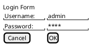

# PlantUML Wireframes

Folder ini berisi wireframe dalam format PlantUML yang dapat di-render menjadi diagram visual.

## 📋 Daftar File

1. **login.puml** - Wireframe halaman login
2. **dashboard-penghuni.puml** - Wireframe dashboard penghuni
3. **pembayaran.puml** - Wireframe halaman pembayaran
4. **komplain.puml** - Wireframe halaman komplain
5. **dashboard-pemilik.puml** - Wireframe dashboard pemilik kost
6. **konfirmasi-pembayaran.puml** - Wireframe konfirmasi pembayaran

## 🚀 Cara Menggunakan

### 1. Install PlantUML

**Via NPM:**
```bash
npm install -g node-plantuml
```

**Via Homebrew (Mac):**
```bash
brew install plantuml
```

**Via Chocolatey (Windows):**
```bash
choco install plantuml
```

### 2. Render Wireframe

**Single File:**
```bash
# Render ke PNG
plantuml login.puml

# Render ke SVG
plantuml -tsvg login.puml

# Render dengan output folder
plantuml login.puml -o ../images/
```

**All Files:**
```bash
# Render semua file .puml di folder ini
plantuml *.puml

# Render ke folder images
plantuml *.puml -o ../images/
```

### 3. Online Editor

Jika tidak ingin install, gunakan online editor:

1. Buka: https://www.plantuml.com/plantuml/uml/
2. Copy-paste isi file .puml
3. Klik "Submit" untuk render
4. Download hasil sebagai PNG/SVG

**Atau gunakan VS Code extension:**
- Install: "PlantUML" by jebbs
- Open .puml file
- Press `Alt+D` untuk preview

## 📐 Format PlantUML Salt

Wireframe ini menggunakan PlantUML Salt (Simple ASCII Layout Tool) untuk membuat wireframe UI.

### Syntax Dasar:



### Elemen Salt:

- `{ }` - Container/Group
- `[ ]` - Button
- `( )` - Radio button
- `[ ]` - Checkbox (dengan text)
- `"text"` - Label
- `|` - Column separator
- `--` - Horizontal separator
- `{T }` - Tab
- `{+ }` - Tree
- `{# }` - Table

### Styling:

- `<b>text</b>` - Bold
- `<i>text</i>` - Italic
- `<size:20>text</size>` - Font size
- `<color:red>text</color>` - Color

## 🎨 Customization

### Mengubah Theme:

Tambahkan di awal file:


Available themes: plain, blueprint, sketchy, etc.

### Mengubah Font:


## 📊 Export Options

### Format Output:
- **PNG** - Raster image (default)
- **SVG** - Vector image (scalable)
- **EPS** - Encapsulated PostScript
- **PDF** - Portable Document Format

### Command:
```bash
# PNG (default)
plantuml file.puml

# SVG
plantuml -tsvg file.puml

# PDF
plantuml -tpdf file.puml
```

## 🔧 Troubleshooting

### Error: "Cannot find Java"
PlantUML requires Java. Install Java JRE:
```bash
# Windows (Chocolatey)
choco install jre8

# Mac (Homebrew)
brew install java

# Ubuntu/Debian
sudo apt install default-jre
```

### Error: "Syntax error"
- Check bracket matching `{ }`
- Ensure proper separators `|` and `--`
- Validate with online editor first

### Render Quality Issues
- Use SVG format for better quality
- Increase DPI: `plantuml -Sdpi=300 file.puml`
- Use vector format for printing

## 📚 Resources

### Documentation:
- PlantUML Official: https://plantuml.com/
- Salt Documentation: https://plantuml.com/salt
- VS Code Extension: https://marketplace.visualstudio.com/items?itemName=jebbs.plantuml

### Examples:
- PlantUML Gallery: https://real-world-plantuml.com/
- Salt Examples: https://plantuml.com/salt#examples

### Tools:
- Online Editor: https://www.plantuml.com/plantuml/uml/
- VS Code Extension: "PlantUML" by jebbs
- IntelliJ Plugin: PlantUML integration

## 📝 Notes

- PlantUML Salt cocok untuk wireframe sederhana
- Untuk wireframe kompleks, gunakan HTML wireframe
- Output PNG cocok untuk dokumentasi
- Output SVG cocok untuk presentasi

---

**Created for**: Projek Analisis & Perancangan - Sistem KostKu  
**Course**: PBKK (Pemrograman Berbasis Kerangka Kerja)  
**Institution**: Universitas Semarang
